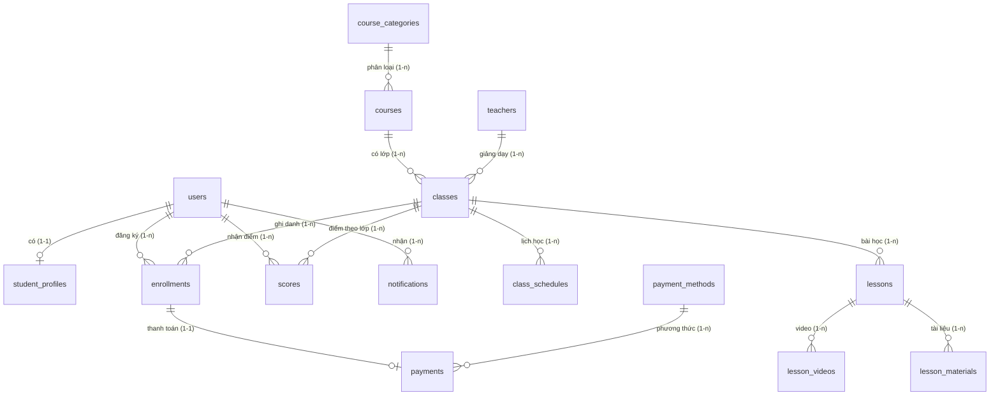

# 🎓 Tata English Center - Hệ Thống Quản Lý Trung Tâm Tiếng Anh

Chào mừng bạn đến với **Tata English Center** - giải pháp web toàn diện dành cho việc quản lý học tập, lớp học, khóa học và vận hành các hoạt động tại một trung tâm Tiếng Anh hiện đại. Hệ thống được phát triển theo mô hình **Full-stack (ReactJS + ExpressJS + MySQL)**, hỗ trợ tối đa cho cả học viên và quản trị viên trong các quy trình nghiệp vụ hàng ngày.

---

## 🌐 Cổng Kết Nối Trực Tuyến

- **Cổng thông tin Web Portal (Production):** [https://tata-english-center.netlify.app/](https://tata-english-center.netlify.app/)

---

## 📊 Công Nghệ Sử Dụng & Huy Hiệu

[](https://tata-english-center.netlify.app/)
[](https://react.dev/)
[](https://www.typescriptlang.org/)
[](https://vitejs.dev/)
[](https://ant.design/)
[](https://redux-toolkit.js.org/)
[](https://nodejs.org/)
[](https://expressjs.com/)
[](https://www.mysql.com/)

Hệ thống được xây dựng trên các công nghệ hiện đại, đảm bảo tính ổn định và khả năng mở rộng tốt:

| Thành phần        | Công nghệ / Thư viện       | Mô tả                                                                      |
| :---------------- | :------------------------- | :------------------------------------------------------------------------- |
| **Frontend**      | ReactJS (v18) + TypeScript | Thư viện xây dựng giao diện người dùng và định kiểu kiểu dữ liệu chặt chẽ. |
|                   | Vite (v8)                  | Công cụ build frontend thế hệ mới siêu nhanh.                              |
|                   | Ant Design (v4)            | Bộ thư viện UI component chuyên nghiệp, trực quan.                         |
|                   | Redux Toolkit              | Quản lý state toàn cục của ứng dụng (Auth, User...).                       |
|                   | React Router DOM (v7)      | Quản lý định tuyến và luồng chuyển trang.                                  |
|                   | Axios                      | Thư viện gọi các API Restful từ backend.                                   |
|                   | Day.js                     | Thư viện xử lý và định dạng thời gian.                                     |
| **Backend**       | Node.js + ExpressJS        | Môi trường chạy và framework xây dựng Restful APIs.                        |
|                   | MySQL2                     | Driver kết nối CSDL MySQL hiệu năng cao hỗ trợ Promise.                    |
|                   | JWT (JSON Web Tokens)      | Cơ chế xác thực phân quyền an toàn giữa Client và Server.                  |
|                   | bcrypt                     | Băm bảo mật mật khẩu trước khi lưu vào cơ sở dữ liệu.                      |
|                   | Multer                     | Xử lý upload tài liệu, file và hình ảnh đại diện lên server.               |
|                   | Nodemailer                 | Gửi thư điện tử qua giao thức SMTP.                                        |
| **Cơ sở dữ liệu** | MySQL (8.0+)               | Hệ quản trị cơ sở dữ liệu quan hệ lưu trữ dữ liệu tập trung.               |

---

## 🚀 Các Tính Năng Nổi Bật

### 👨‍🎓 Dành Cho Học Viên (Student Portal)

Học viên sau khi đăng nhập có thể quản lý lộ trình học tập trực quan:

- **Đăng ký tài khoản & Đăng nhập:** Xác thực danh tính an toàn với JWT và bcrypt.
- **Quản lý thông tin cá nhân (Profile):** Cập nhật ảnh đại diện (avatar), thông tin liên hệ và lịch sử cá nhân.
- **Khám phá Khóa học:** Xem thông tin chi tiết về các khóa học (mục tiêu, trình độ, thời lượng, học phí).
- **Ghi danh & Đăng ký lớp học:** Gửi yêu cầu đăng ký lớp học và theo dõi trạng thái phê duyệt (_Chờ duyệt / Đã duyệt / Từ chối_).
- **Thanh toán học phí trực tuyến (Simulated Gateway):** Hỗ trợ nhiều hình thức thanh toán mô phỏng bao gồm:
  - **Chuyển khoản VietQR:** Tự động tạo mã QR động theo đúng số tiền học phí và nội dung chuyển khoản sử dụng API VietQR.
  - **Ví điện tử MoMo:** Giả lập thanh toán qua MoMo.
  - **Cổng VNPAY:** Giả lập cổng thanh toán thẻ ATM/Visa/Mastercard.
  - **Tiền mặt:** Hướng dẫn nộp trực tiếp tại quầy lễ tân của trung tâm.
- **Lịch học & Thời khóa biểu:** Giao diện lịch biểu hàng tuần trực quan giúp theo dõi chính xác ca học, phòng học và giảng viên.
- **Học tập trực tuyến (Lessons & Materials):**
  - Xem danh sách bài giảng theo từng buổi học.
  - Xem video bài giảng đính kèm (YouTube/Vimeo embed).
  - Tải tài liệu bài học (.pdf, .docx, .pptx, v.v.).
- **Bảng điểm (Scores):** Xem kết quả điểm số chi tiết từng môn kèm nhận xét từ giáo viên/admin.
- **Hộp thư thông báo (Notifications):** Nhận các cập nhật về trạng thái duyệt học phí, thay đổi phòng học, hoặc cập nhật điểm số.

### 👩‍💼 Dành Cho Quản Trị Viên (Admin Portal)

Hỗ trợ đắc lực cho công việc vận hành và quản lý của trung tâm:

- **Trực quan hóa Dữ liệu (Dashboard):**
  - Thống kê tổng số học viên, số lượng khóa học, lớp học và các yêu cầu ghi danh đang chờ xử lý.
  - Biểu đồ doanh thu trực quan theo từng tháng/năm.
  - Thống kê phân bố học viên theo từng khóa học.
  - Thống kê điểm số trung bình của các lớp học để đánh giá chất lượng dạy và học.
- **Quản lý Khóa học:** Thêm mới, sửa thông tin, hoặc xóa các khóa học theo danh mục (TOEIC, IELTS, Giao tiếp, Tiếng Anh trẻ em...).
- **Quản lý Lớp học & Lịch học:**
  - Tạo lớp học mới, phân công giáo viên phụ trách, giới hạn sĩ số tối đa.
  - Xếp lịch học hàng tuần (Thứ mấy, giờ bắt đầu, giờ kết thúc, phòng học).
- **Quản lý Học viên:** Tra cứu, lọc tìm kiếm thông tin học viên; thực hiện khóa hoặc mở khóa tài khoản người dùng.
- **Quản lý Yêu cầu Ghi danh (Enrollments):** Xét duyệt (Đồng ý/Từ chối) học viên đăng ký tham gia lớp học.
- **Quản lý Điểm số:** Nhập và cập nhật điểm số của học viên theo lớp (thang điểm 10) kèm theo nhận xét chi tiết.
- **Quản lý Thanh toán (Payments):** Theo dõi danh sách hóa đơn, thay đổi trạng thái đóng học phí của học viên theo cách thủ công (dành cho thanh toán tiền mặt) hoặc theo dõi thanh toán tự động qua hệ thống mô phỏng.
- **Quản lý Giáo viên:** Quản lý thông tin danh sách giáo viên, số điện thoại, email và chuyên môn giảng dạy.
- **Quản lý & Gửi thông báo:** Soạn thảo và gửi thông báo chung hoặc riêng biệt tới từng người dùng.

### 🤖 Hệ Thống Dịch Vụ Tự Động (Background Services)

- **Gửi Email tự động (Nodemailer):** Tự động gửi email thông báo cho học viên khi:
  - Đăng ký tài khoản thành công.
  - Thay đổi trạng thái học phí (xác nhận đóng học phí thành công).
  - Cập nhật lịch học đột xuất.
- **Nhắc nhở lịch học trước 30 phút (Reminder Service):** Hệ thống chạy nền tự động quét lịch học mỗi phút 1 lần. Nếu phát hiện lớp học sắp diễn ra sau 30 phút, hệ thống tự động gửi thông báo in-app nhắc nhở học viên chuẩn bị lên lớp.

---

## 📂 Cấu Trúc Thư Mục Dự Án

```text
BTL_THLTW/
├── back-end/               # Backend API Server (Node.js/Express)
│   ├── src/
│   │   ├── config/         # Cấu hình kết nối MySQL pool
│   │   ├── controllers/    # Xử lý logic nghiệp vụ API (auth, class, payment, stats...)
│   │   ├── middlewares/    # Middleware kiểm tra token JWT, upload file, phân quyền
│   │   ├── routes/         # Khai báo các endpoint API
│   │   ├── services/       # Dịch vụ gửi mail & chạy nền nhắc nhở lịch học
│   │   └── server.js       # Điểm khởi chạy của Backend Server
│   ├── uploads/            # Lưu trữ file tài liệu và ảnh đại diện tải lên
│   ├── .env.example        # Bản mẫu cấu hình biến môi trường
│   └── package.json        # Định nghĩa dependencies của Backend
│
├── front-end/              # Frontend Web Application (ReactJS/TypeScript)
│   ├── src/
│   │   ├── assets/         # Tài nguyên hình ảnh, biểu tượng tĩnh
│   │   ├── components/     # Các component dùng chung (Layout, ProtectedRoute, PaymentModal...)
│   │   ├── pages/          # Các trang chính của hệ thống
│   │   │   ├── admin/      # Giao diện quản lý của Admin (Dashboard, Courses, Classes...)
│   │   │   ├── student/    # Giao diện học tập của Học viên (Schedule, Scores, Lessons...)
│   │   │   ├── LandingPage # Trang chủ giới thiệu trung tâm
│   │   │   ├── Login.tsx   # Trang Đăng nhập
│   │   │   └── Register.tsx# Trang Đăng ký
│   │   ├── store/          # Cấu hình Redux Store & các Slices
│   │   ├── utils/          # Cấu hình Axios Client instance và helper functions
│   │   ├── App.tsx         # Component cấu hình định tuyến chính
│   │   └── main.tsx        # File khởi tạo React app
│   ├── index.html          # File HTML gốc
│   ├── package.json        # Định nghĩa dependencies của Frontend
│   └── vite.config.ts      # Cấu hình dự án Vite
│
├── database/
│   └── data.sql            # Script khởi tạo cơ sở dữ liệu và dữ liệu mẫu thử nghiệm
└── README.md               # Hướng dẫn và tài liệu dự án
```

---

## 🗄️ Thiết Kế Cơ Sở Dữ Liệu

Hệ thống sử dụng cơ sở dữ liệu có tên `english_center_management`.

### Sơ Đồ Quan Hệ Thực Thể (ERD)



### Các Bảng Trong Cơ Sở Dữ Liệu

| Tên Bảng            | Mô Tả Chức Năng                                                                                                                               |
| :------------------ | :-------------------------------------------------------------------------------------------------------------------------------------------- |
| `users`             | Lưu trữ tài khoản người dùng: họ tên, email, mật khẩu băm, SĐT, vai trò (`quản trị viên` / `học viên`), trạng thái (`hoạt động` / `bị khóa`). |
| `student_profiles`  | Hồ sơ chi tiết của học viên: ngày sinh, giới tính, địa chỉ, đường dẫn ảnh đại diện.                                                           |
| `course_categories` | Phân loại khóa học (như TOEIC, IELTS, Tiếng Anh Giao Tiếp...).                                                                                |
| `courses`           | Thông tin khóa học: tên khóa, cấp độ yêu cầu, học phí định mức, thời lượng.                                                                   |
| `teachers`          | Danh sách thông tin giảng viên tại trung tâm.                                                                                                 |
| `classes`           | Thông tin lớp học được mở từ các khóa học, liên kết với giảng viên đứng lớp.                                                                  |
| `class_schedules`   | Thời khóa biểu của từng lớp học trong tuần (Thứ mấy, giờ học, phòng học).                                                                     |
| `enrollments`       | Danh sách đăng ký lớp học của học viên và trạng thái phê duyệt.                                                                               |
| `payment_methods`   | Các hình thức thanh toán được hỗ trợ (tiền mặt, chuyển khoản, ví điện tử...).                                                                 |
| `payments`          | Hóa đơn học phí chi tiết gắn với từng đăng ký của học viên.                                                                                   |
| `lessons`           | Danh sách bài học của từng lớp để quản lý giáo trình.                                                                                         |
| `lesson_videos`     | Các video bài giảng đi kèm bài học (dưới dạng URL nhúng).                                                                                     |
| `lesson_materials`  | File tài liệu đính kèm bài học để tải về.                                                                                                     |
| `scores`            | Điểm số đánh giá học viên tại từng lớp học kèm nhận xét.                                                                                      |
| `notifications`     | Các thông báo hệ thống gửi đến cho từng cá nhân người dùng.                                                                                   |

### Ràng Buộc Nghiệp Vụ Quan Trọng

- **Tránh trùng lặp ghi danh:** Học viên chỉ có thể đăng ký tối đa một lần vào cùng một lớp học (`UNIQUE(student_id, class_id)`).
- **Hóa đơn duy nhất:** Mỗi lượt đăng ký lớp học chỉ phát sinh tối đa một hóa đơn học phí (`enrollment_id` là khóa duy nhất trong bảng `payments`).
- **Giới hạn điểm số:** Thang điểm bắt buộc nằm trong khoảng từ `0` đến `10` (`CHECK (score >= 0 AND score <= 10)`).
- **Ràng buộc thời gian:** Ngày kết thúc lớp học phải lớn hơn hoặc bằng ngày bắt đầu; giờ kết thúc buổi học phải sau giờ bắt đầu.

---

## ⚙️ Hướng Dẫn Cài Đặt Và Chạy Dự Án

### Yêu Cầu Hệ Thống

- Đã cài đặt **Node.js** (Khuyên dùng bản LTS từ v18 trở lên).
- Đã cài đặt **MySQL Server** (v8.0 trở lên) hoặc XAMPP.
- Trình quản lý gói **npm** (tự động đi kèm Node.js).

---

### Bước 1: Thiết Lập Cơ Sở Dữ Liệu MySQL

1. Khởi động MySQL Server (bằng MySQL Command Line Client, MySQL Workbench hoặc Control Panel XAMPP).
2. Tạo CSDL và nạp dữ liệu mẫu bằng cách chạy script SQL từ file `database/data.sql`:
   ```bash
   mysql -u root -p < database/data.sql
   ```
   _(Hoặc bạn có thể mở MySQL Workbench / phpMyAdmin, tạo CSDL tên `english_center_management` rồi copy nội dung file `data.sql` và thực thi)._

---

### Bước 2: Cài Đặt & Chạy Backend

1. Di chuyển vào thư mục backend:
   ```bash
   cd back-end
   ```
2. Cài đặt các gói phụ thuộc:
   ```bash
   npm install
   ```
3. Tạo file cấu hình môi trường `.env` tại thư mục gốc của backend (`back-end/.env`). Bạn có thể copy từ `.env.example` và điều chỉnh các thông số phù hợp:
   ```env
   PORT=5000
   DB_HOST=localhost
   DB_USER=your_mysql_username      # Thường là root
   DB_PASSWORD=your_mysql_password  # Mật khẩu MySQL của bạn
   DB_NAME=english_center_management
   JWT_SECRET=tata_english_center_secret_key
   ```
   > [!NOTE]
   > Hãy chắc chắn điền chính xác `DB_PASSWORD` để Backend kết nối thành công với MySQL.
4. Chạy Backend Server ở chế độ nhà phát triển (sử dụng nodemon tự động tải lại khi đổi code):
   ```bash
   npm run dev
   ```
   _Server backend mặc định sẽ lắng nghe tại cổng: `http://localhost:5000`_

---

### Bước 3: Cài Đặt & Chạy Frontend

1. Mở một cửa sổ terminal mới và di chuyển vào thư mục frontend:
   ```bash
   cd front-end
   ```
2. Cài đặt các thư viện liên quan:
   ```bash
   npm install
   ```
3. Khởi chạy ứng dụng client ở chế độ phát triển:
   ```bash
   npm run dev
   ```
   _Ứng dụng sẽ tự động mở trên trình duyệt tại địa chỉ: `http://localhost:5173`_

---

## 🔑 Tài Khoản Thử Nghiệm Hệ Thống

Để thuận tiện cho việc kiểm thử các tính năng phân quyền giữa Quản trị viên và Học viên, bạn có thể đăng nhập bằng các tài khoản mẫu có sẵn trong CSDL:

| Vai Trò                   | Email Đăng Nhập                                    | Mật Khẩu Mặc Định |
| :------------------------ | :------------------------------------------------- | :---------------- |
| **Quản Trị Viên (Admin)** | `admin@englishcenter.edu.vn`                       | `password`        |
| **Học Viên (Student)**    | `student2@gmail.com`                               | `password`        |
|                           | `student3@gmail.com` _(đến `student26@gmail.com`)_ | `password`        |

---

## 💡 Ghi Chú Phát Triển Trải Nghiệm (Aesthetics & Design)

- **Thiết kế Giao diện:** Giao diện sử dụng bộ màu hiện đại, tối ưu trải nghiệm của Ant Design.
- **Trực quan hóa Dữ liệu:** Dashboard sử dụng các biểu đồ SVG tinh gọn để trực quan hóa doanh thu và các chỉ số hoạt động.
- **Mô phỏng Thanh toán:** Cho phép người dùng trải nghiệm luồng thanh toán hoàn chỉnh bằng cách hiển thị mã QR trực quan qua API VietQR thực tế hoặc các nút mô phỏng kết quả giao dịch thành công/thất bại nhanh chóng.
- **Xử lý tài liệu:** Các tài liệu bài học và avatar học viên được quản lý trực tiếp qua Middleware Multer, lưu trữ an toàn trong thư mục `/uploads`.
